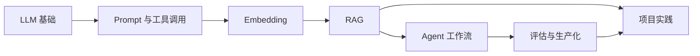

# AI Play

<table>
  <tr>
    <td width="140" valign="middle">
      
    </td>
    <td valign="middle">
      <p><strong>AI 技术学习平台</strong></p>
      <p>从 LLM 基础、Prompt、Embedding、RAG、Agent 到评估与生产化，把“能看懂”变成“能做出来”。</p>
      <p>
        <a href="./CHANGELOG.md">Changelog</a> ·
        <a href="./docs/RAG_KNOWLEDGE_BASE.md">RAG 知识库</a> ·
        <a href="./docs/KNOWLEDGE_IMPORT.md">知识导入</a>
      </p>
    </td>
  </tr>
</table>

## 这个项目是什么

AI Play 是一个基于 Electron + React 的桌面学习应用，内置课程内容、本地知识库、RAG 学习助手和可导入资料能力。它的目标不是只讲概念，而是把 AI 应用的完整链路拆开给你看。

## 一眼看懂

| 模块 | 作用 |
| --- | --- |
| 学习课程 | 用分层内容讲清楚 LLM、Prompt、Embedding、RAG、Agent、Eval |
| 本地知识库 | 把课程、资料目录和导入内容做成可检索索引 |
| RAG 助手 | 用检索结果回答问题，并展示引用片段 |
| 桌面能力 | 支持文件导入、配置保存、安装包发布和快捷方式 |

## 内容地图



### 1. LLM 基础

- 什么是 LLM
- token、上下文窗口、温度
- 结构化输出
- 什么时候不该直接用模型

### 2. Prompt 与工具调用

- 如何写稳定提示
- 如何定义工具 Schema
- 如何处理错误和人工确认
- 如何把模型接入真实业务流程

### 3. Embedding 与语义检索

- 什么是 Embedding
- feature hashing 与神经 embedding
- 相似度检索
- chunk 切分与元数据

### 4. RAG

- 文档解析
- chunking
- 检索 TopK
- 引用回答
- 权限过滤与评估

### 5. Agent

- Agent 和普通工作流的区别
- Observe-Think-Act 循环
- 工具、记忆、计划执行
- 安全边界和停止条件

### 6. 评估与生产化

- 评估集
- 日志与可观测性
- 成本控制
- 降级、回滚与反馈闭环

## 项目长什么样


这个项目当前的核心体验包括：

- 左侧课程导航，按主题和层级组织 AI 知识
- 中间学习内容，支持搜索、练习、测验和完成状态
- 右侧 RAG 助手，支持检索本地知识和导入资料
- Electron 桌面打包，支持安装器、便携包和系统快捷方式

## 目录结构

```txt
src/                前端页面、课程内容和知识助手
electron/           桌面主进程和 IPC
knowledge/raw/      内置知识库原始 Markdown
public/knowledge/   构建后的知识索引
scripts/            知识构建与校验脚本
docs/               知识库与导入说明
```

## 本地运行

```bash
npm install
npm run dev
```

打包桌面应用：

```bash
npm run electron:pack
```

## 打包产物

- Windows 安装器：`AI-Play-*-win-x64.exe`
- Windows 便携包：`AI-Play-*-win-x64.zip`
- macOS：`AI-Play-*-mac-*.dmg`
- Linux：`AI-Play-*-linux-*.AppImage`

## 文档

- [RAG_KNOWLEDGE_BASE.md](docs/RAG_KNOWLEDGE_BASE.md)
- [KNOWLEDGE_IMPORT.md](docs/KNOWLEDGE_IMPORT.md)
- [Changelog](CHANGELOG.md)

## 适合谁

- 刚开始学 AI 应用的人
- 想理解 RAG / Agent / Prompt 工程的人
- 想看一个桌面 AI 学习工具如何组织内容的人
- 想做本地知识库和 AI 助手原型的人
